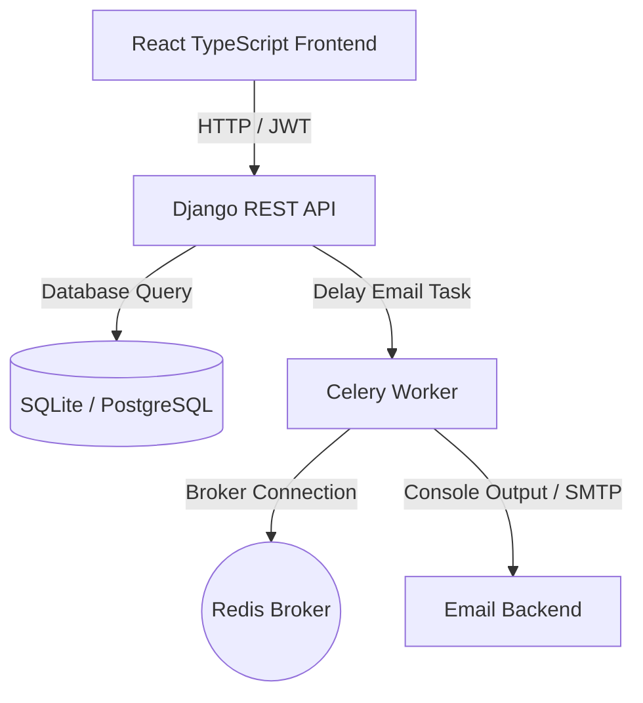

# 🎓 CDGI College Academic No-Dues Portal

A modern, role-based Academic No-Dues clearance tracking system designed for Chameli Devi Group of Institutions (CDGI). This platform automates the cumbersome paper-based clearance process for students, faculties, coordinators, and HODs.

---

## 🚀 Key Features by User Roles

### 1. 👨‍🎓 Students
- **Dues Ledger**: Live view of pending/cleared holds across all subjects.
- **Task Submissions**: Upload verified lab manuals, NPTEL certificates, or assignments directly to clear holds.
- **Clearance Certificate**: Automatically generate and download a secure clearance certificate once cleared by all faculties and the class coordinator.

### 2. 👩‍🏫 Faculty
- **Submission Queue**: Review uploaded documentation, add reviewer remarks, and approve/reject submissions.
- **Task Publishing**: Create new assignments or clearance checkpoints (e.g. lab manual submissions) for specific subjects/semesters.

### 3. 🏫 Class Coordinators
- **Classroom Reports**: Monitor clearance progress (clearance ratios and percentages) for entire classes.
- **Pending List**: Filter down students with active department/subject holds.
- **Coordinator Clearance**: Formally sign off on a student's final compliance checklist.

### 4. 👑 HOD & Admin
- **Faculty Management**: Register, list, and remove faculty profiles.
- **Subject Allocations**: Dynamically assign teaching faculties to subjects/courses.
- **Cycle Controls**: Toggle global no-dues cycle states (open/closed) per semester.
- **Analytics Charts**: Interactive reports indicating cleared vs. pending count per course.
- **Excel Export**: Export the live status ledger of the college using `openpyxl`.

---

## 🛠️ Project Architecture



### Tech Stack
- **Frontend**: React.js, TypeScript, Vite, Tailwind CSS, Lucide icons, React Router.
- **Backend**: Django, Django REST Framework, SimpleJWT (Authentication).
- **Worker & Caching**: Celery, Redis.
- **Reporting**: openpyxl (Excel engine).

---

## 📂 Project Structure

```
No-dues portal/
├── no-dues-portal/         # React TypeScript Frontend
│   ├── src/
│   │   ├── components/     # Reusable UI Components
│   │   ├── pages/          # Dashboards (Student, Faculty, Admin, Coordinator)
│   │   └── services/       # API Axios Client
├── no_dues_backend/        # Django Backend App
│   ├── accounts/           # User management, roles, and profiles
│   ├── portal/             # Dues tracking, assignments, submissions & views
│   └── no_dues_backend/    # Celery configuration & settings
```

---

## 🔌 API Endpoints Reference

### 🔐 Authentication
| Method | Endpoint | Description |
|---|---|---|
| `POST` | `/api/auth/token/` | Obtain JWT access & refresh tokens |
| `POST` | `/api/auth/token/refresh/` | Refresh JWT access token |

### 👨‍🎓 Student Endpoints
| Method | Endpoint | Description |
|---|---|---|
| `GET` | `/api/student/tasks` | Get student tasks & submission status |
| `GET` | `/api/student/dues` | View department/subject dues status |
| `GET` | `/api/student/certificate` | Generate & view clearance certificate |
| `POST` | `/api/student/submissions` | Upload assignment submission file |

### 👩‍🏫 Faculty Endpoints
| Method | Endpoint | Description |
|---|---|---|
| `GET` | `/api/faculty/submissions` | List student submissions |
| `GET` | `/api/faculty/submissions/<id>` | View submission detail |
| `PATCH` | `/api/faculty/submissions/<id>` | Approve/reject student submission |
| `GET` | `/api/faculty/subjects` | List assigned subjects |
| `POST` | `/api/faculty/assignments` | Publish a new due checkpoint |

### 🏫 Coordinator Endpoints
| Method | Endpoint | Description |
|---|---|---|
| `GET` | `/api/coordinator/class-report` | Class-wide dues clearance ratio report |
| `GET` | `/api/coordinator/pending-students`| List students with pending holds |
| `POST` | `/api/coordinator/approve-clearance/<id>` | Grant coordinator clearance |

### 👑 Admin / HOD Endpoints
| Method | Endpoint | Description |
|---|---|---|
| `GET`/`POST` | `/api/admin/faculty` | List or add faculty members |
| `DELETE` | `/api/admin/faculty/<id>` | Delete a faculty member |
| `POST` | `/api/admin/subjects/allocate` | Link subject to a faculty member |
| `POST` | `/api/admin/semester/toggle` | Toggle semester cycle status |
| `GET` | `/api/admin/config` | Fetch active global cycle status |
| `GET` | `/api/admin/reports` | Get course analytics dataset |
| `GET` | `/api/admin/export/excel` | Download formatted Excel ledger |

---

## ⚙️ Running Locally

### 1. Backend Setup
1. Navigate to the backend directory:
   ```bash
   cd no_dues_backend
   ```
2. Activate virtual environment:
   ```bash
   source venv/bin/env/activate  # or venv/bin/activate
   ```
3. Run migrations and start server:
   ```bash
   python manage.py migrate
   python manage.py runserver
   ```
4. Start Celery worker:
   ```bash
   celery -A no_dues_backend worker --loglevel=info
   ```

### 2. Frontend Setup
1. Navigate to the frontend directory:
   ```bash
   cd no-dues-portal
   ```
2. Install packages & run Vite server:
   ```bash
   npm install
   npm run dev
   ```
